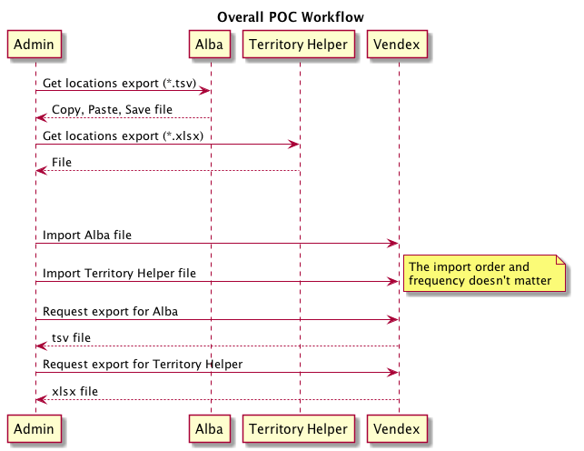
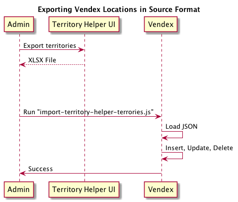
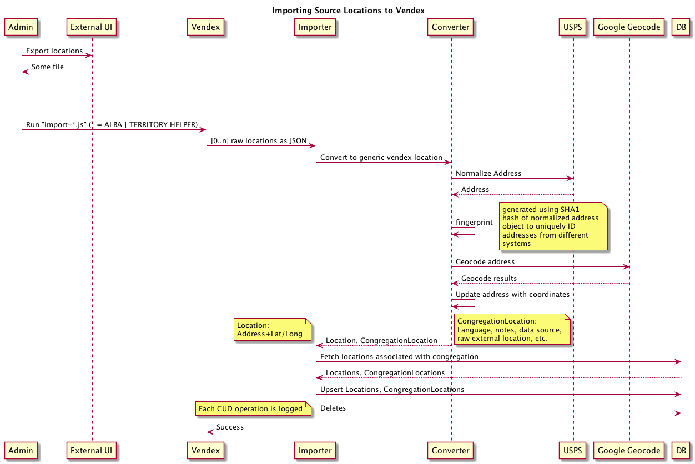
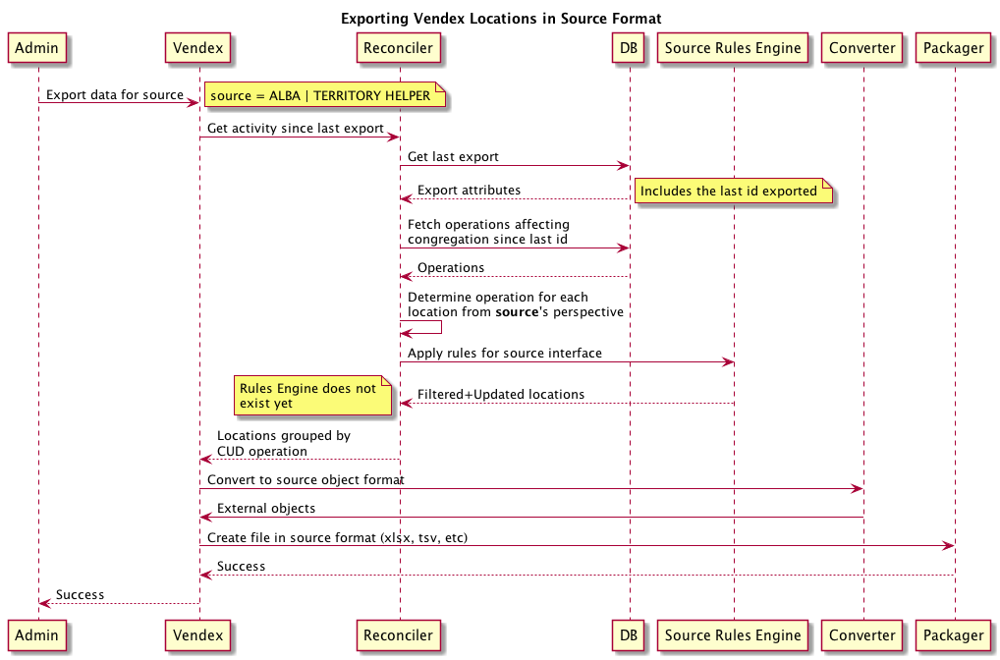

Read Me
===

# Scripts

Run commands with `npm run xzy`. Or you can directly run the node script. but base it 
on the script in package.json's scripts stanza.

- `npm run create-db`: Drops and recreates the DB. You'll want to do this once before you start, since
the current version on the VM is outdated. However, don't run it to frequently. Google
has a limit of 2500 requests per day; the responses are stored in the DB to 
avoid hitting the limit during testing.
- `npm run import-th-territories`: Imports the territories from Territory Helper's 
territory export. This is used by the `export-th` script to associate new locations to 
the correct territory
- `npm run import-alba-territories`: This is a synthesized file with a single record - 
the congregation boundaries.
- `npm run import-th`: Import the location export file from Territory Helper.
- `npm run import-alba`: Import the location export file from Alba.
- `npm run export-th`: Generates a file that can be imported into Territory Helper.
Also includes additional data to explain conflicts or ambiguous matches.

# Sequence Diagrams

## Overview

- Import territories
- Import files from the respective systems
- Generate an export file

## Territory Import

## Importing Locations from a Source

## Exporting Locations in a Source's Format

Diagrams generated using [PlantUML](http://plantuml.com/)